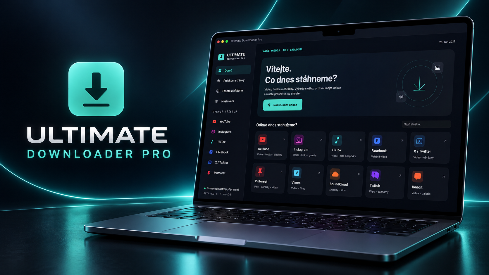

<div align="center">
  

  # Ultimate Downloader Pro

  **Nativní správce stahování médií pro macOS**

  
  
  
  
</div>

Ultimate Downloader Pro spojuje stahování videí, audia a obrázků do jedné přehledné aplikace. Nabízí průzkum médií na stránce, výběr kvality a formátu, společnou frontu, historii, protokoly a přihlášení ke službám ve vlastním bezpečně odděleném okně.

> **Beta verze:** aplikace je určena k testování. Funkčnost jednotlivých služeb se může měnit podle jejich webu a použitých extraktorů.

## Stažení a instalace

Aktuální instalační obraz je součástí repozitáře:

### [Stáhnout Ultimate Downloader Pro Beta 0.3.1](instalace/Ultimate%20Downloader%20Pro%20Beta%200.3.1.dmg)

1. Stáhněte soubor DMG a otevřete jej.
2. Přetáhněte **Ultimate Downloader Pro** do složky **Aplikace**.
3. Pokud už máte starší kopii, potvrďte její nahrazení.
4. Po dokončení instalační obraz vysuňte.

Instalátor má lokální podpis a zatím není notarizován společností Apple. Při prvním spuštění proto může macOS vyžadovat potvrzení v **Nastavení systému → Soukromí a zabezpečení**.

Kontrolní SHA-256 je uveden v souboru [SHA256SUMS.txt](instalace/SHA256SUMS.txt).

## Hlavní funkce

- video, audio a obrázky v jedné aplikaci;
- 22 připravených vstupů včetně YouTube, Instagramu, TikToku, Facebooku, X, Pinterestu, Vimeo, SoundCloudu, Redditu a univerzální webové stránky;
- vyhledávání YouTube, načtení playlistů a hromadný výběr položek;
- výběr dostupné kvality, MP4, MKV, WebM, MP3, M4A, FLAC, WAV, JPEG a PNG;
- časový výřez videa nebo zvuku;
- samostatné titulky SRT, pokud je zdroj nabízí;
- společná fronta, zrušení úlohy, opakování, historie, protokoly a otevření ve Finderu;
- oblíbené profily stahování;
- volitelné sledování odkazu ve schránce bez automatického spuštění stahování;
- systémová oznámení o dokončení a chybách;
- světlý, tmavý a systémový motiv;
- rozšíření **Sdílet** pro předání odkazu z jiných aplikací.

Ve verzi **Beta 0.3.1** byl opraven kontrast světlého motivu a přibylo mazání jednotlivých záznamů i celé historie fronty. Vymazání historie odstraní pouze záznamy aplikace; stažené soubory zůstávají beze změny.

## Jak aplikaci používat

1. Na domovské obrazovce vyberte službu nebo univerzální průzkum webu.
2. Vložte adresu a zvolte **Prozkoumat**.
3. Vyberte jednu nebo více nalezených položek.
4. Nastavte kvalitu, formát a případný časový výřez.
5. Sledujte průběh ve frontě; hotový soubor lze otevřít ve Finderu.

## Potřebné nástroje

Aplikace využívá nástroje nainstalované v systému. Nejsou vloženy přímo do instalačního balíčku.

```sh
brew install yt-dlp ffmpeg gallery-dl
```

Jejich stav lze zkontrolovat a aktualizovat přímo v nastavení aplikace. Homebrew se automaticky neinstaluje.

## Soukromí a zabezpečení

- Zpracování a ukládání probíhá lokálně na Macu.
- Sledování schránky je ve výchozím stavu vypnuté a nikdy samo nespustí stahování.
- Přihlášení probíhá ve vlastním WebKit okně aplikace; cookies Safari se nečtou.
- Extraktoru se předají pouze cookies platné pro danou doménu prostřednictvím dočasného souboru s oprávněním `0600`, který se po operaci odstraní.
- Aplikace neobchází DRM. Některé soukromé stránky, CAPTCHA nebo expirované odkazy nemusí fungovat.

Další informace jsou v [zásadách ochrany soukromí](docs/SOUKROMI.md) a [bezpečnostních pokynech](SECURITY.md).

## Systémové požadavky

- macOS 14 Sonoma nebo novější;
- Mac s Apple silicon nebo procesorem Intel;
- připojení k internetu;
- Homebrew a nástroje uvedené výše pro skutečné stahování a převod.

## Sestavení ze zdrojů

Projekt otevřete v Xcode nebo použijte příkaz:

```sh
xcodebuild \
  -project UltimateDownloader.xcodeproj \
  -scheme UltimateDownloader \
  -configuration Release \
  -derivedDataPath build.noindex \
  build
```

Podrobnosti jsou v [návodu pro sestavení](docs/SESTAVENI.md). Příspěvky a hlášení chyb se řídí souborem [CONTRIBUTING.md](CONTRIBUTING.md).

## Ověření a známá omezení

Release sestavení Beta 0.3.1 bylo vytvořeno jako univerzální aplikace pro `arm64` a `x86_64`. Základní průchod aplikací, skutečné načtení metadat z YouTube a TikToku, lokální test obrázků a videa, formáty, fronta, zrušení procesu a časový výřez byly ověřeny. Úspěšné stažení obsahu za přihlášením na Instagramu zatím ověřeno nebylo.

Podpora webů závisí také na aktuální verzi `yt-dlp`, `gallery-dl` a změnách konkrétních služeb. Označení podporované služby proto neznamená záruku každého odkazu nebo soukromého obsahu.

## Právní upozornění

Stahujte pouze obsah, ke kterému máte potřebná práva nebo souhlas. Uživatel odpovídá za dodržení autorského práva a podmínek příslušné služby.

## Použité projekty

- [yt-dlp](https://github.com/yt-dlp/yt-dlp)
- [FFmpeg](https://ffmpeg.org/)
- [gallery-dl](https://github.com/mikf/gallery-dl)

## Autor a licence

Vytvořil [Marian Čonka](https://github.com/conkamarian1987). Zdrojový kód a grafické podklady jsou zveřejněny pro kontrolu a osobní použití; další podmínky určuje soubor [LICENSE](LICENSE).

