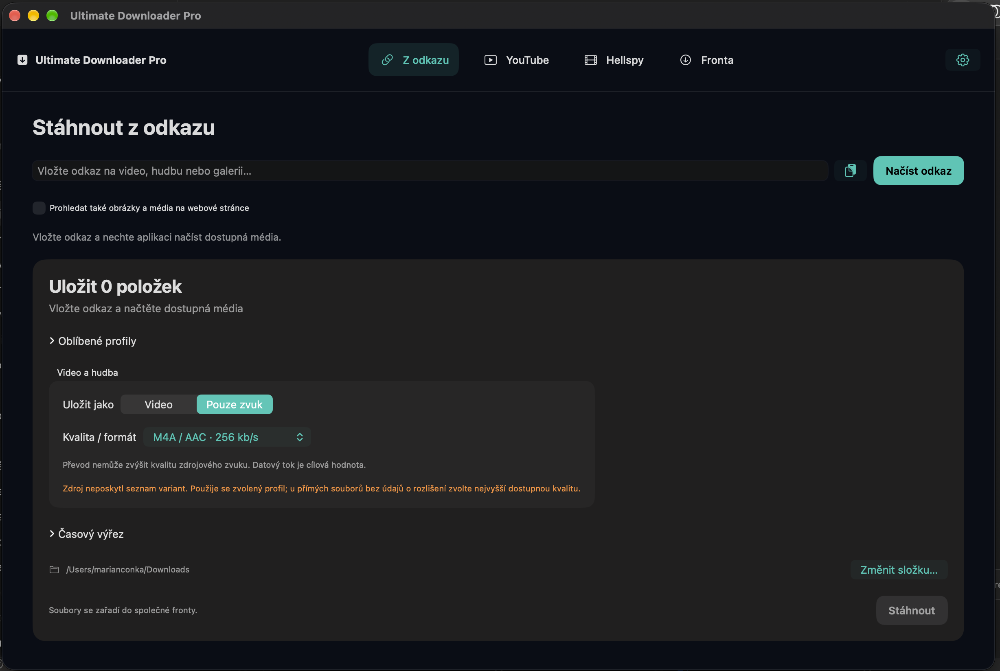
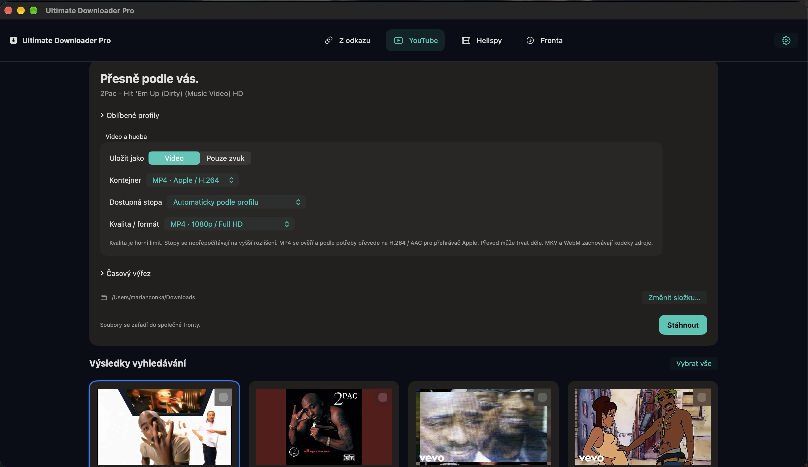
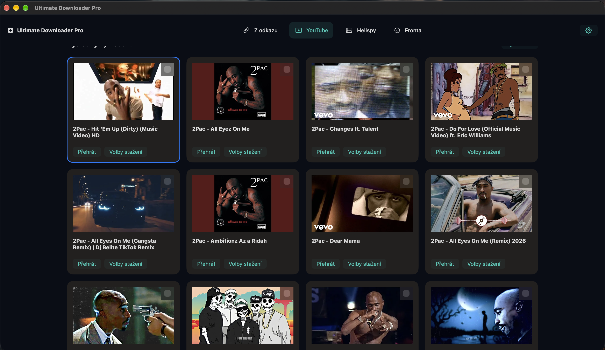
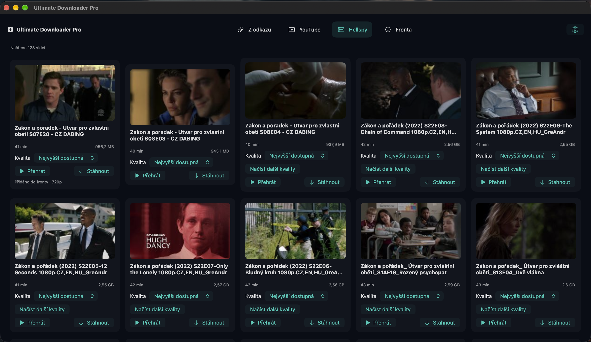
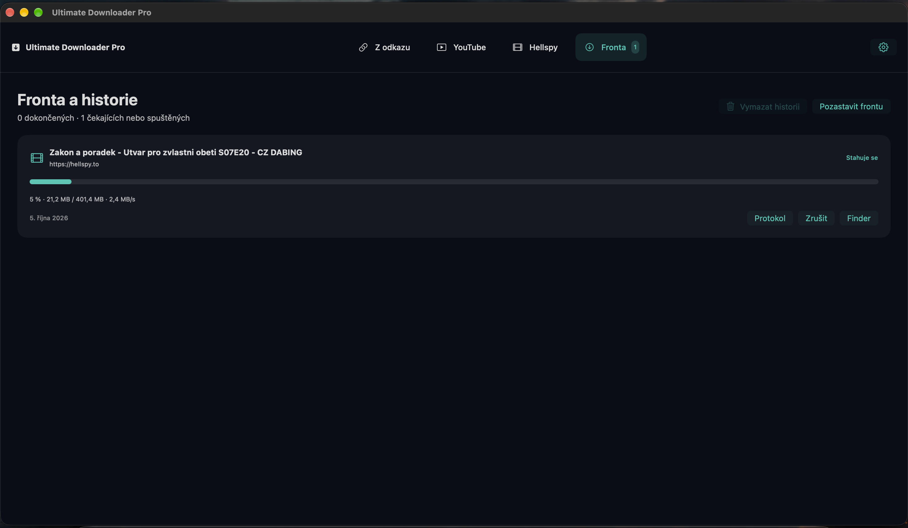
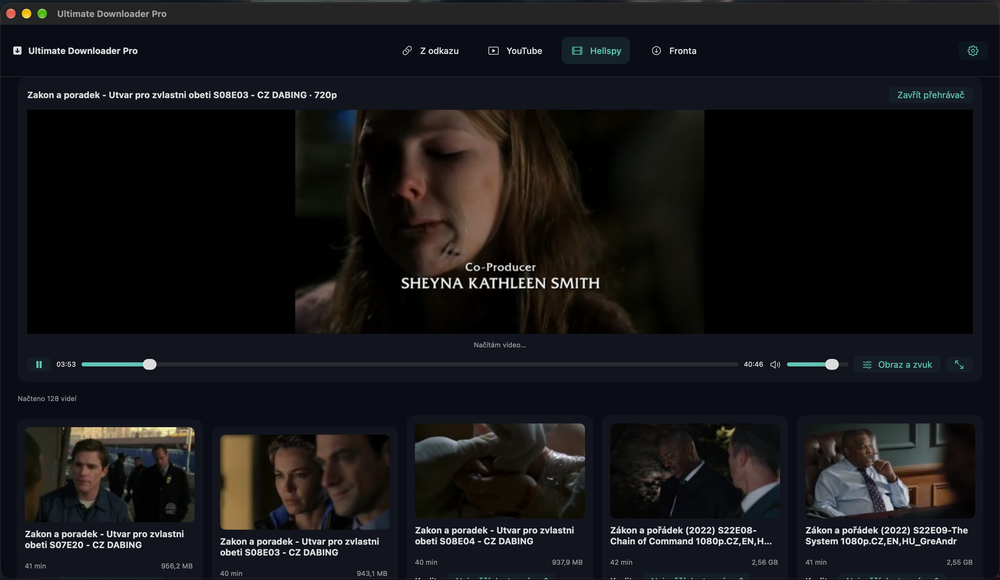

<div align="center">
  

  # Encore

  **Video, hudba a oblíbené služby na jednom místě**

  
  
  
  
</div>

Encore (dříve Ultimate Downloader Pro) spojuje vyhledávání, přehrávání a stahování videí, audia a obrázků do jedné přehledné aplikace. Nabízí průzkum médií na stránce, výběr kvality a formátu, společnou frontu, historii, protokoly a přihlášení ke službám ve vlastním bezpečně odděleném okně.

## Ultimate Downloader Pro se mění na Encore

**Stejná aplikace, nová identita.** Encore přináší novou ikonu, přehledný levý panel a sjednocený vzhled ve stylu Liquid Glass. Původní uživatelé přejdou aktualizací přes dosavadní kanál a zachovají si nastavení i historii.

> **Beta verze:** aplikace je určena k testování. Funkčnost jednotlivých služeb se může měnit podle jejich webu a použitých extraktorů.

## Stažení a instalace

Aktuální balíček **0.8.0 (13)** je pro Macy s **Apple silicon (M1 a novější)**. VLC je součástí aplikace.

### [Stáhnout Encore Beta 0.8.0 — sestavení 13](https://github.com/conkamarian1987/encore/raw/refs/heads/main/instalace/Encore-0.8.0.zip)

**Přecházíte z Ultimate Downloader Pro?** Verze s aktualizátorem Sparkle přejdou na Encore přes původní aktualizační kanál. Zachovává se identifikátor aplikace, podpisový klíč, historie, relace i nastavení. Aktualizátor nahradí původní balíček na jeho místě; jeho název souboru ve Finderu může zůstat původní. Pro nové instalace se používá **Encore.app**. Fastshare, Webshare, online rádia a Google Disk jsou plánované služby a zatím nejsou součástí aplikace.

**Máte verzi 0.5.0 nebo 0.6.0?** V nabídce aplikace zvolte **Zkontrolovat aktualizace…**. Sparkle ověří podpis balíčku a nahradí aktualizovanou kopii aplikace na jejím místě.

**Od verze 0.7.0 je kontrola při spuštění povinná.** Bez připojení nebo úspěšného ověření zůstane aplikace zablokovaná; lze ověření zopakovat nebo aplikaci ukončit. Dostupnou aktualizaci nelze přeskočit. Po úspěšném ověření už během tohoto běhu další kontroly neprobíhají.

**Ve verzi 0.7.0** se nabídka aktualizace zobrazí při novém spuštění aplikace. Od 0.7.1 se původní proces výslovně ukončí, jakmile instalátor potvrdí připravenost. Externí instalátor nahradí aplikaci a spustí novou verzi. Samotné nahrazení může být velmi rychlé. Přechod z 0.7.0 ještě používá starý aktualizační kód, takže při něm může být naposledy nutné ruční ukončení.

Pro první instalaci:

1. Stáhněte ZIP a rozbalte jej dvojklikem ve Finderu.
2. Ukončete starší verzi aplikace.
3. Přetáhněte **Encore.app** do složky **Aplikace** a potvrďte nahrazení.
4. Spusťte aplikaci ze složky Aplikace.

Instalátor má lokální podpis a zatím není notarizován společností Apple. Při prvním spuštění proto může macOS vyžadovat potvrzení v **Nastavení systému → Soukromí a zabezpečení**.

Kontrolní SHA-256 je uveden v souboru [SHA256SUMS.txt](instalace/SHA256SUMS.txt).

## Hlavní funkce

- video, audio a obrázky v jedné aplikaci;
- levý panel se sekcemi **Z odkazu**, **YouTube**, **Hellspy** a **Fronta**;
- vyhledávání Hellspy se stránkováním, kvalitou a tlačítky Přehrát / Stáhnout u každého výsledku;
- vestavěný VLC přehrávač se zvukovými stopami, titulky, poměrem stran, ořezem, přiblížením a časovým posunem;
- celá obrazovka pouze pro video; kurzor a ovládání se při přehrávání skryjí po třech sekundách nečinnosti;
- ochrana displeje proti ztmavení a uspání během přehrávání na celé obrazovce;
- živý průběh, přenesená velikost a rychlost stahování z Hellspy;
- podepsané aktualizace přes Sparkle s povinným ověřením pouze při spuštění;
- univerzální odkaz pro video, audio i galerie; dostupná média zjišťují yt-dlp a gallery-dl;
- volby formátu, kvality a cílové složky přímo pod odkazem;
- přehrávač YouTube přímo v záložce; při přepnutí mimo YouTube se uvolní;
- kontrola MP4 a případný převod na H.264 / AAC pro přehrávače Apple, s průběhem převodu ve frontě;
- vyhledávání YouTube, načtení playlistů a hromadný výběr položek;
- výběr dostupné kvality, MP4, MKV, WebM, MP3, M4A, FLAC, WAV, JPEG a PNG;
- časový výřez videa nebo zvuku;
- samostatné titulky SRT, pokud je zdroj nabízí;
- společná fronta, zrušení úlohy, opakování, historie, protokoly a otevření ve Finderu;
- oblíbené profily stahování;
- volitelné sledování odkazu ve schránce bez automatického spuštění stahování;
- systémová oznámení o dokončení a chybách;
- světlý, tmavý a systémový motiv;
- rozšíření **Sdílet** pro předání odkazu z jiných aplikací.

Ve verzi **Beta 0.6.0 (10)** přibyla záložka Hellspy a vestavěný přehrávač VLC. Nastavení otevřete spodní ikonou v levém panelu. Historie, uložené profily a nastavení zůstávají zachované. Podrobnosti obsahuje [CHANGELOG.md](CHANGELOG.md).

## Jak aplikaci používat

### Z odkazu

Vložte HTTP(S) adresu a zvolte **Načíst odkaz**. Pod ní jsou přímo volby videa či zvuku, formátu, kvality a cílové složky. Po načtení jediného média se položka vybere automaticky. U více položek použijte **Volby stažení**, zaškrtnutí nebo **Vybrat vše**. Obrázkové volby se zobrazí pro nalezené obrázky. Oblíbené profily a časový výřez jsou rozbalovací. **Stáhnout** zařadí úlohu do fronty.

Pro širší průzkum zapněte **Prohledat také obrázky a média na webové stránce**. Pro celý playlist či album použijte příslušný přepínač po načtení odkazu.

### YouTube

Zadejte dotaz nebo odkaz a zvolte **Vyhledat**. U výsledku vyberte **Přehrát** nebo **Volby stažení**. Přehrávač i nastavení stažení se zobrazí ve stejné záložce. Výsledky a rozepsané vstupy zůstávají při přepínání záložek zachované.

### Hellspy a přehrávač

Zadejte název videa a zvolte **Vyhledat**. Další výsledky se načítají při posouvání dolů nebo tlačítkem **Další výsledky**. Každá karta má **Přehrát**, **Stáhnout** a výběr kvality; tlačítko **Načíst další kvality** načte dostupné varianty. Přehrání automaticky přesune pohled k přehrávači. Stahování pokračuje ve společné frontě.

**Obraz a zvuk** umožňuje vybrat zvukovou stopu, zapnout nebo vypnout titulky, přidat vlastní soubor titulků a upravit obraz i časový posun zvuku/titulků. Dostupnost stop závisí na konkrétním videu.

Tlačítkem celé obrazovky zvětšíte samotné video. Po třech sekundách nečinnosti během přehrávání zmizí kurzor i ovládání; pohyb myši je vrátí. **Esc** ukončí celou obrazovku. Při pauze, zastavení nebo návratu do okna se uvolní ochrana displeje proti uspání. Přepnutí na jinou záložku přehrávání ukončí.

### Fronta a nastavení

Záložka **Fronta** ukazuje počet čekajících a spuštěných úloh, průběh stahování i převodu, historii a protokoly. Mazání historie neodstraňuje stažené soubory. Spodní ikona levého panelu otevírá nastavení motivu, nástrojů, schránky, oznámení a přihlášení ke službám.

## Obrázky rozhraní

Skutečné snímky verze **Beta 0.6.0 (10)** dodané autorem 5. 10. 2026.

### Z odkazu — formát a kvalita



### YouTube — volby stažení



### YouTube — výsledky vyhledávání



### Hellspy — výsledky, kvalita a ovládání u každého videa



### Fronta — procenta, přenesená velikost a rychlost



### Hellspy — vestavěný přehrávač VLC



## Potřebné nástroje

Pro stahování přes obecné odkazy a převody aplikace využívá systémové nástroje. VLC a Sparkle jsou vložené přímo do balíčku; samostatnou aplikaci VLC nepotřebujete. Hellspy používá vlastní přímé stahování.

```sh
brew install yt-dlp ffmpeg gallery-dl
```

Jejich stav lze zkontrolovat a aktualizovat přímo v nastavení aplikace. Homebrew se automaticky neinstaluje.

## Soukromí a zabezpečení

- Zpracování a ukládání probíhá lokálně na Macu.
- Sledování schránky je ve výchozím stavu vypnuté a nikdy samo nespustí stahování.
- Přihlášení probíhá ve vlastním WebKit okně aplikace; cookies Safari se nečtou.
- Extraktoru se předají pouze cookies platné pro danou doménu prostřednictvím dočasného souboru s oprávněním `0600`, který se po operaci odstraní.
- Aplikace neobchází DRM. Některé soukromé stránky, CAPTCHA nebo expirované odkazy nemusí fungovat.

Další informace jsou v [zásadách ochrany soukromí](docs/SOUKROMI.md) a [bezpečnostních pokynech](SECURITY.md).

## Systémové požadavky

- macOS 14 Sonoma nebo novější;
- Mac s Apple silicon (aktuálně distribuovaný balíček `arm64`);
- připojení k internetu;
- Homebrew a nástroje uvedené výše pro skutečné stahování a převod.

## Sestavení ze zdrojů

Nejdříve stáhněte připnuté frameworky, poté projekt otevřete v Xcode nebo použijte příkaz:

```sh
python3 Tools/setup_sparkle.py
python3 Tools/setup_vlckit.py
xcodebuild \
  -project UltimateDownloader.xcodeproj \
  -scheme UltimateDownloader \
  -configuration Release \
  -derivedDataPath build.noindex \
  build
```

Podrobnosti jsou v [návodu pro sestavení](docs/SESTAVENI.md). Příspěvky a hlášení chyb se řídí souborem [CONTRIBUTING.md](CONTRIBUTING.md).

## Ověření a známá omezení

Release sestavení 0.8.0 (13) pro `arm64` a kontrola lokálního podpisu prošly 7. 10. 2026. ZIP má ověřený podpis Ed25519. Testy brány i předání instalace prošly. Skutečný test na oddělené aplikaci se stejným kódem potvrdil automatické ukončení starého procesu, nahrazení na stejném místě, odstranění souboru ze staré verze a spuštění nového procesu. Podrobnosti a hranice ověření: [test instalace](docs/TEST-INSTALACE-0.8.0.md).

Aplikace má ad-hoc podpis, není podepsaná Apple Developer ID ani notarizovaná. Povinná aktualizace není licenční systém a neblokuje starší vydání, která tuto kontrolu ještě neměla.

Podrobnosti vydání: [0.8.0](docs/VYDANI-0.8.0.md). Návod: [Tools/AKTUALIZACE.md](Tools/AKTUALIZACE.md).
