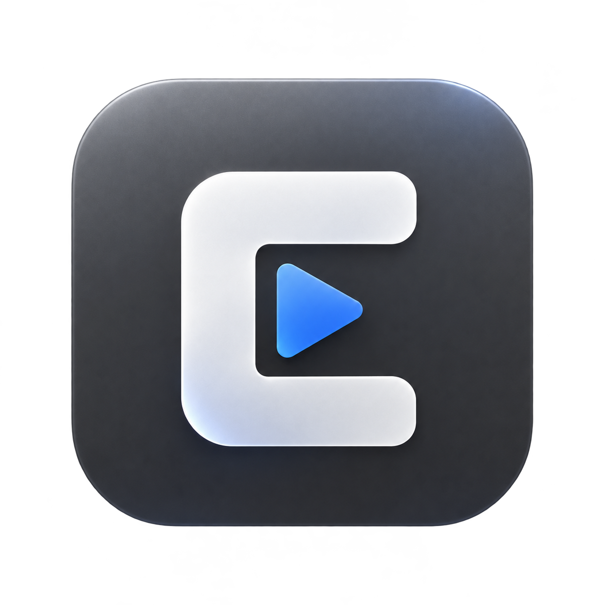

<div align="center">
  

  # Ultimate Downloader Pro

  **Nativní správce stahování médií pro macOS**

  
  
  
  
</div>

Ultimate Downloader Pro spojuje stahování videí, audia a obrázků do jedné přehledné aplikace. Nabízí průzkum médií na stránce, výběr kvality a formátu, společnou frontu, historii, protokoly a přihlášení ke službám ve vlastním bezpečně odděleném okně.

> **Beta verze:** aplikace je určena k testování. Funkčnost jednotlivých služeb se může měnit podle jejich webu a použitých extraktorů.

## Stažení a instalace

Aktuální instalační balíček obsahuje univerzální aplikaci pro Apple silicon i Intel:

### [Stáhnout Ultimate Downloader Pro Beta 0.4.0 — sestavení 7](https://github.com/conkamarian1987/ultimate-downloader-pro/raw/refs/heads/main/instalace/Ultimate%20Downloader%20Pro%20Beta%200.4.0.zip)

1. Stáhněte ZIP a rozbalte jej dvojklikem ve Finderu.
2. Ukončete starší verzi aplikace.
3. Přetáhněte **Ultimate Downloader Pro.app** do složky **Aplikace** a potvrďte nahrazení.
4. Spusťte aplikaci ze složky Aplikace.

Instalátor má lokální podpis a zatím není notarizován společností Apple. Při prvním spuštění proto může macOS vyžadovat potvrzení v **Nastavení systému → Soukromí a zabezpečení**.

Kontrolní SHA-256 je uveden v souboru [SHA256SUMS.txt](instalace/SHA256SUMS.txt).

## Hlavní funkce

- video, audio a obrázky v jedné aplikaci;
- tři záložky **Z odkazu**, **YouTube** a **Fronta**, bez domovské obrazovky a levého menu;
- univerzální odkaz pro video, audio i galerie; dostupná média zjišťují yt-dlp a gallery-dl;
- volby formátu, kvality a cílové složky přímo pod odkazem;
- přehrávač YouTube přímo v záložce; při přepnutí mimo YouTube se uvolní;
- kontrola MP4 a případný převod na H.264 / AAC pro přehrávače Apple, s průběhem převodu ve frontě;
- vyhledávání YouTube, načtení playlistů a hromadný výběr položek;
- výběr dostupné kvality, MP4, MKV, WebM, MP3, M4A, FLAC, WAV, JPEG a PNG;
- časový výřez videa nebo zvuku;
- samostatné titulky SRT, pokud je zdroj nabízí;
- společná fronta, zrušení úlohy, opakování, historie, protokoly a otevření ve Finderu;
- oblíbené profily stahování;
- volitelné sledování odkazu ve schránce bez automatického spuštění stahování;
- systémová oznámení o dokončení a chybách;
- světlý, tmavý a systémový motiv;
- rozšíření **Sdílet** pro předání odkazu z jiných aplikací.

Ve verzi **Beta 0.4.0 (7)** je stahování soustředěné do tří horních záložek. Nastavení otevřete ozubeným kolečkem. Historie, uložené profily a nastavení zůstávají zachované. Podrobnosti obsahuje [CHANGELOG.md](CHANGELOG.md).

## Jak aplikaci používat

### Z odkazu

Vložte HTTP(S) adresu a zvolte **Načíst odkaz**. Pod ní jsou přímo volby videa či zvuku, formátu, kvality a cílové složky. Po načtení jediného média se položka vybere automaticky. U více položek použijte **Volby stažení**, zaškrtnutí nebo **Vybrat vše**. Obrázkové volby se zobrazí pro nalezené obrázky. Oblíbené profily a časový výřez jsou rozbalovací. **Stáhnout** zařadí úlohu do fronty.

Pro širší průzkum zapněte **Prohledat také obrázky a média na webové stránce**. Pro celý playlist či album použijte příslušný přepínač po načtení odkazu.

### YouTube

Zadejte dotaz nebo odkaz a zvolte **Vyhledat**. U výsledku vyberte **Přehrát** nebo **Volby stažení**. Přehrávač i nastavení stažení se zobrazí ve stejné záložce. Výsledky a rozepsané vstupy zůstávají při přepínání záložek zachované.

### Fronta a nastavení

Záložka **Fronta** ukazuje počet čekajících a spuštěných úloh, průběh stahování i převodu, historii a protokoly. Mazání historie neodstraňuje stažené soubory. Ozubené kolečko otevírá motiv, nástroje, schránku, oznámení a přihlášení ke službám.

## Obrázky rozhraní

Starší úvodní obrázek byl odstraněn z hlavní prezentace, aby nezobrazoval neaktuální navigaci. Skutečné screenshoty rozhraní 0.4.0 zatím nejsou přiložené: služba pro zachycení a ovládání okna během jejich pořizování opakovaně havarovala a náhradní systémové pořízení snímků zablokovala oprávnění prostředí. Ikona výše není screenshot aplikace.

## Potřebné nástroje

Aplikace využívá nástroje nainstalované v systému. Nejsou vloženy přímo do instalačního balíčku.

```sh
brew install yt-dlp ffmpeg gallery-dl
```

Jejich stav lze zkontrolovat a aktualizovat přímo v nastavení aplikace. Homebrew se automaticky neinstaluje.

## Soukromí a zabezpečení

- Zpracování a ukládání probíhá lokálně na Macu.
- Sledování schránky je ve výchozím stavu vypnuté a nikdy samo nespustí stahování.
- Přihlášení probíhá ve vlastním WebKit okně aplikace; cookies Safari se nečtou.
- Extraktoru se předají pouze cookies platné pro danou doménu prostřednictvím dočasného souboru s oprávněním `0600`, který se po operaci odstraní.
- Aplikace neobchází DRM. Některé soukromé stránky, CAPTCHA nebo expirované odkazy nemusí fungovat.

Další informace jsou v [zásadách ochrany soukromí](docs/SOUKROMI.md) a [bezpečnostních pokynech](SECURITY.md).

## Systémové požadavky

- macOS 14 Sonoma nebo novější;
- Mac s Apple silicon nebo procesorem Intel;
- připojení k internetu;
- Homebrew a nástroje uvedené výše pro skutečné stahování a převod.

## Sestavení ze zdrojů

Projekt otevřete v Xcode nebo použijte příkaz:

```sh
xcodebuild \
  -project UltimateDownloader.xcodeproj \
  -scheme UltimateDownloader \
  -configuration Release \
  -derivedDataPath build.noindex \
  build
```

Podrobnosti jsou v [návodu pro sestavení](docs/SESTAVENI.md). Příspěvky a hlášení chyb se řídí souborem [CONTRIBUTING.md](CONTRIBUTING.md).

## Ověření a známá omezení

Release sestavení 0.4.0 (7) prošlo pro `arm64` i `x86_64`, stejně jako kontrola lokálního podpisu aplikace a vloženého rozšíření. Testy časových údajů, ukládání profilů a kompatibility starší historie prošly. Nové rozhraní zatím není koncově ověřené klikáním kvůli pádu ovládací služby. Test převodu vytvořil MP4 H.264/yuv420p/AAC; ověření dekódování AVFoundation v omezeném testovacím prostředí skončilo chybou `Cannot Decode`, takže aktuální průchod tímto testem nepotvrzujeme. Dřívější testy kompatibility jsou zahrnuté ve zdrojích.

Balíček se nyní distribuuje jako ZIP. Vytvoření nového DMG bylo v prostředí vydání zablokované nedostupnými službami DiskManagement. Zdrojové kódy, číslo sestavení a ZIP v tomto repozitáři patří ke stejné verzi.

Podpora webů závisí také na aktuální verzi `yt-dlp`, `gallery-dl` a změnách konkrétních služeb. Označení podporované služby proto neznamená záruku každého odkazu nebo soukromého obsahu.

## Právní upozornění

Stahujte pouze obsah, ke kterému máte potřebná práva nebo souhlas. Uživatel odpovídá za dodržení autorského práva a podmínek příslušné služby.

## Použité projekty

- [yt-dlp](https://github.com/yt-dlp/yt-dlp)
- [FFmpeg](https://ffmpeg.org/)
- [gallery-dl](https://github.com/mikf/gallery-dl)

## Autor a licence

Vytvořil [Marian Čonka](https://github.com/conkamarian1987). Zdrojový kód a grafické podklady jsou zveřejněny pro kontrolu a osobní použití; další podmínky určuje soubor [LICENSE](LICENSE).

